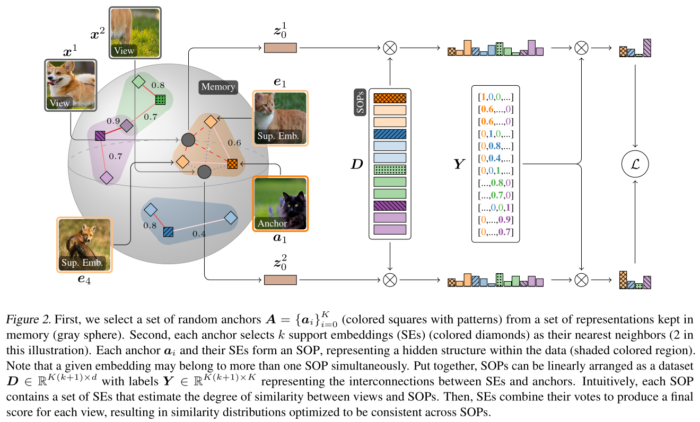
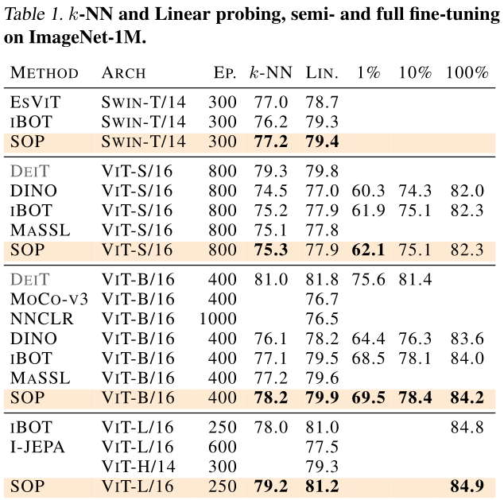

## Overview

Self-supervised learning (SSL) has become a cornerstone for learning visual representations without labels. Most state-of-the-art SSL methods for computer vision rely on *prototypes*—learnable vectors that are supposed to represent hidden clusters in the data. However, these approaches have important limitations:

- **Over-clustering:** They require a large number of prototypes (much more than the number of semantic classes), leading to high computational cost and suboptimal feature learning.
- **Equipartition constraints:** They need special regularization (like Sinkhorn-Knopp or centering) to avoid collapsed solutions.
- **Underrepresentation:** Single prototypes may fail to capture the full complexity of the data, especially in sparse or ambiguous regions.

**Self-Organizing Visual Prototypes (SOP)** is a new, non-parametric approach to SSL that addresses these issues by representing each region in feature space using *multiple real data embeddings* (support embeddings), rather than a single learnable prototype.

---

## Key Ideas

<div style="text-align: center;">
  
</div>

- **Non-parametric Prototypes:** 
  SOPs are built from real data embeddings stored in memory, not from learned parameters.

- **Support Embeddings:** 
  Each SOP consists of an anchor and its $k$ nearest neighbors in feature space. These support embeddings together describe a region, capturing richer and more diverse features.

- **Dynamic and Adaptive:** 
  SOPs are rebuilt every iteration by randomly sampling new anchors and supports. This ensures full coverage of the feature space and prevents prototype drift or collapse.

- **No Over-Clustering Required:** 
  SOPs naturally fill the feature space without requiring a large number of prototypes. Randomized, overlapping regions provide comprehensive coverage.

- **No Equipartition Regularization:** 
  SOPs avoid the need for constraints like Sinkhorn-Knopp or centering. Randomization and data-driven selection prevent collapse and ensure stability.

---

## How SOP Works

1. **Anchor Sampling:**
   At each training step, SOP randomly selects $K$ anchor embeddings from a memory bank containing features from previously seen images.

2. **Support Construction:**
   For each anchor, SOP finds its $k$ nearest neighbors in the memory bank. The anchor and its supports together define a Self-Organizing Prototype (SOP), representing a local region in the feature space.

3. **Voting and Aggregation:**
   Each support embedding casts a vote (weighted by its similarity to the anchor) regarding how well a new view matches the SOP. These votes are aggregated to form a soft assignment of the view to each SOP.

4. **Similarity Computation:**
   For a view $u$, the probability of assignment to each SOP is computed as:
   $$
   P(u) = \mathrm{softmax}(u D^\top) Y
   $$
   where $D$ is the matrix of all SOP support embeddings and $Y$ contains the soft contribution weights of each support.

5. **Loss Functions:**
   - **Global ([CLS]) Loss:**
     Encourages consistency between the SOP assignments of different augmented views of the same image:
     $$
     L_{\text{CLS}} = -\sum_x P(z^1_0)^\top \log P(z^2_0)
     $$
   - **SOP-MIM (Masked Image Modeling) Loss:**
     Trains the model to reconstruct masked patches using local SOPs, further enriching the learned representations.

6. **No Learnable Prototypes:**
   SOPs are always constructed from real data embeddings and are dynamically rebuilt every iteration, ensuring adaptability and preventing prototype drift or collapse.

---

## Why SOP?

- **Richer, More Adaptive Prototypes:** 
  Each region is described by multiple real embeddings, capturing more complex and fine-grained features.

- **No Over-Clustering:** 
  SOPs naturally fill the feature space without needing a huge number of prototypes.

- **Stable & Regularization-Free:** 
  No need for equipartition constraints—randomization and data-driven selection prevent collapse.

- **Better Transfer & Robustness:** 
  SOP achieves state-of-the-art or competitive performance on linear probing, k-NN, object detection, segmentation, image retrieval, and robustness benchmarks.

---

## Results

<div style="text-align: center;">
  
</div>

---

## FAQ

**Q: Do SOPs require special regularization or clustering tricks?** 
A: No. SOPs avoid the need for equipartition, centering, or sharpening. Randomization and data-driven selection are enough to prevent collapse.

**Q: How do SOPs perform on transfer learning tasks?** 
A: SOPs achieve state-of-the-art or competitive results on a wide range of downstream tasks, including classification, detection, segmentation, and retrieval.

**Q: Are SOPs scalable?** 
A: Yes. SOPs scale well with model size and do not require a large number of prototypes, reducing computational and memory requirements.

---


## Citation

```
@inproceedings{
silva2025selforganizing,
title={Self-Organizing Visual Prototypes for Non-Parametric Representation Learning},
author={Thalles Silva and Helio Pedrini and Ad{\'\i}n Ram{\'\i}rez Rivera},
booktitle={Forty-second International Conference on Machine Learning},
year={2025},
url={https://openreview.net/forum?id=NGC7wdMFao}
}
```

